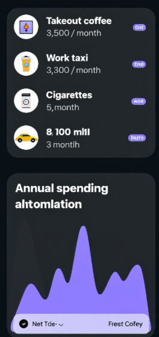
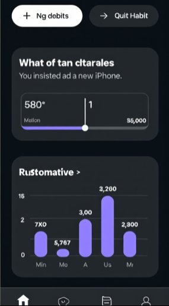
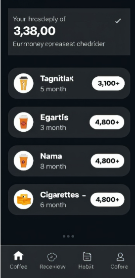

Спецификация требований к программному обеспечению "Цена привычки" - Система учета и анализа финансовых привычек

**ВВЕДЕНИЕ**

**1.1. Назначение**

Документ описывает функциональные и нефункциональные требования к веб-приложению "Цена привычки" для учета, анализа и визуализации финансовых последствий регулярных привычек.

**1.2. Область действия**

"Цена привычки" - веб-приложение, предоставляющее инструменты для расчета долгосрочных затрат от регулярных трат, сравнения с альтернативными финансовыми целями и управления персональными сбережениями.

**1.3. Определения, акронимы и сокращения**

\- SRS- Software Requirements Specification

\- API- Application Programming Interface

\- UI- User Interface

\- UX- User Experience

\- ROI- Return on Investment (Окупаемость инвестиций)

**1.4. Ссылки**

\- IEEE Std 830-1998

\- ГОСТ 34.602-89

**2.Общее описание**

**2.1. Возможности продукта**

\- Расчет долгосрочных затрат на привычки

\- Сравнение стоимости привычек с финансовыми целями

\- Визуализация накоплений и прогресса целей

\- Аналитическая отчетность по привычкам

\- Управление финансовыми целями и сроками

**2.2. Классы пользователей**

\- Обычный пользователь: учет привычек, просмотр аналитики, постановка целей

\- Финансово грамотный пользователь: глубокий анализ, оптимизация расходов, планирование

\- Семейный пользователь: совместное использование, семейные цели

**2.3. Операционное окружение**

\- Веб-браузеры: Chrome, Firefox, Safari, Edge

\- Мобильные устройства: iOS, Android (PWA)

\- Требуется подключение к интернету для синхронизации данных

**2.4. Ограничения**

\- Зависимость от пользовательского ввода данных

\- Ограниченный набор предустановленных целей для сравнения

\- Отсутствие интеграции с банковскими системами

**3.Функциональные требования**

**3.1. Управление привычками**

FR-001: Система должна предоставлять возможность создания, редактирования и удаления привычек

\- Приоритет: Высокий

\- Источник: Пользователь

FR-002: Для каждой привычки пользователь должен указать название, стоимость за раз и периодичность

\- Приоритет: Высокий

FR-003: Пользователь может категоризировать привычки (еда, развлечения, транспорт, здоровье)

\- Приоритет: Средний

**3.2. Расчет стоимости привычек**

FR-004: Система должна автоматически рассчитывать затраты на привычку за различные периоды (неделя, месяц, год, 5 лет)

\- Приоритет: Высокий

FR-005: Расчет должен учитывать указанную пользователем периодичность привычки

\- Приоритет: Высокий

FR-006: Пользователь может ввести сумму уже потраченных средств на привычку

\- Приоритет: Средний

**3.3. Сравнение с целями**

FR-007: Система должна предоставлять предустановленные цели для сравнения (техника, путешествия, образование)

\- Приоритет: Высокий

FR-008: Пользователь может создавать собственные финансовые цели

\- Приоритет: Средний

FR-009: Система должна рассчитывать время достижения цели при перенаправлении средств от привычки

\- Приоритет: Высокий

**3.4. Визуализация данных**

FR-010: Система должна отображать графики накопленных затрат по привычкам

\- Приоритет: Средний

FR-011: Пользователь может выбрать период отображения данных (месяц, год, 5 лет)

\- Приоритет: Средний

FR-012: Система должна предоставлять круговые диаграммы распределения затрат по категориям

\- Приоритет: Низкий

**3.5. Управление целями**

FR-013: Система должна позволять устанавливать целевые суммы и сроки достижения

\- Приоритет: Средний

FR-014: Пользователь может отслеживать прогресс достижения целей

\- Приоритет: Средний

FR-015: Система должна уведомлять о достижении целей

\- Приоритет: Низкий

**3.6. Аналитика и отчетность**

FR-016: Система должна предоставлять сводную статистику по всем привычкам

\- Приоритет: Средний

FR-017: Система должна рассчитывать потенциальные сбережения при отказе от привычек

\- Приоритет: Высокий

**4.Нефункциональные требования**

**4.1. Требования к производительности**

NFR-001: Время загрузки данных не должно превышать 2 секунд

NFR-002: Приложение должно поддерживать до 5000 одновременных пользователей

NFR-003: Время отклика на пользовательские действия не более 500 мс

**4.2. Требования к надежности**

NFR-004: Время безотказной работы - 99.5%

NFR-005: Система должна автоматически сохранять данные при вводе

NFR-006: При перезагрузке страницы данные пользователя должны восстанавливаться

**4.3. Требования к удобству использования**

NFR-007: Интерфейс должен быть интуитивно понятен для пользователей без финансового образования

NFR-008: Приложение должно быть полностью адаптивным для мобильных устройств

NFR-009: Кривая обучения основным функциям не должна превышать 10 минут

**4.4. Требования к безопасности**

NFR-010: Все передаваемые данные должны использовать HTTPS

NFR-011: Валидация входных данных на стороне клиента и сервера

NFR-012: Данные пользователей должны быть изолированы и недоступны другим пользователям

**4.5. Требования к совместимости**

NFR-013: Поддержка последних версий основных браузеров (Chrome, Firefox, Safari, Edge)

NFR-014: Поддержка мобильных браузеров iOS Safari и Android Chrome

NFR-015: Возможность установки как PWA (Progressive Web App)

**4.6. Требования к сопровождаемости**

NFR-016: Кодовая база должна быть документирована

NFR-017: Система должна поддерживать логирование действий для отладки

NFR-018: Архитектура должна позволять легко добавлять новые типы целей и категорий

**4.7. Бизнес-требования**

NFR-019: Система должна поддерживать мультиязычность (русский, английский)

NFR-020: Поддержка различных валют (RUB, USD, EUR)

NFR-021: Возможность бесшовного обновления без потери данных

Дополнительные требования

**5.1. Требования к хранению данных**

\- Данные должны сохраняться локально в браузере пользователя

\- Возможность синхронизации между устройствами при наличии аккаунта

\- Резервное копирование данных раз в 24 часа

**5.2. Требования к доступности**

\- Соответствие WCAG 2.1 Level AA

\- Поддержка скринридеров

\- Достаточный цветовой контраст для пользователей с нарушениями зрения

5\.3. Требования к интернационализации

\- Поддержка правого-левого написания (RTL)	

\- Локализация дат, чисел и валют

\- Адаптация интерфейса под различные культурные особенности

